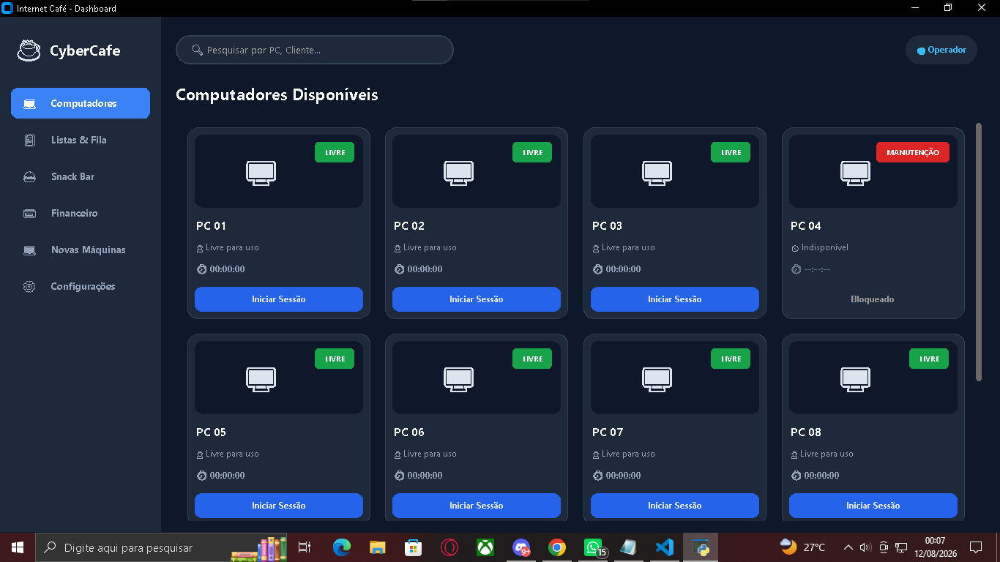

# ☕ PROJETO FINAL DE CURSO
## CyberCafe — Sistema de Gerenciamento de Internet Café

<div align="center">

### 🖥️ Uma aplicação desktop desenvolvida em Python + CustomTkinter



</div>

---

## 📖 Sobre o projeto

O **CyberCafe** é meu **projeto final de curso**, desenvolvido para aplicar na prática os conhecimentos adquiridos durante minha formação em programação.

A proposta foi criar um sistema desktop para auxiliar no gerenciamento de um **Internet Café**, centralizando em uma única aplicação recursos como computadores, sessões, fila de espera, consumo, financeiro, cadastro de novas máquinas e configurações da interface.

O projeto foi construído pensando em um cenário de uso real, com uma interface de dashboard, navegação lateral e diferentes módulos integrados.

### 🎯 Objetivo

Criar uma aplicação que permitisse ao operador acompanhar e administrar as principais operações de um Internet Café de forma organizada, visual e prática.

---

## 🧩 Principais funcionalidades

### 🖥️ Gerenciamento de computadores

O dashboard apresenta os computadores cadastrados em **cards individuais**, permitindo visualizar rapidamente:

- Número do PC
- Status atual
- Disponibilidade
- Tempo de utilização
- Ação para iniciar uma sessão
- Situação de manutenção

Também existe uma área específica para cadastrar novos computadores e visualizar as máquinas cadastradas.


---

### ⏱️ Controle de sessões

O sistema foi pensado para controlar a utilização dos computadores, permitindo trabalhar com:

- Início de sessão
- Controle de tempo
- Status do computador
- Encerramento da utilização
- Cálculo do valor baseado no tempo

Essa funcionalidade conecta diretamente o gerenciamento dos PCs com a parte financeira do sistema.

---

### 👥 Fila de espera

O sistema possui uma área dedicada à **fila de espera**, onde o operador pode:

- Informar o nome do cliente
- Adicionar o cliente à fila
- Acompanhar os clientes aguardando atendimento


---

### 🥤 Snack Bar / Consumo

O módulo de Snack Bar permite selecionar um computador ocupado e registrar itens consumidos.

Produtos demonstrados no sistema:

| Produto | Valor |
|---|---:|
| 🥤 Refrigerante | R$ 6,00 |
| 🥪 Salgado | R$ 8,00 |
| 💧 Água 500ml | R$ 3,50 |
| ☕ Café Expresso | R$ 4,50 |
| 🍫 Chocolate | R$ 5,00 |


---

### 💰 Controle financeiro

O sistema possui uma área de **Histórico Financeiro**, preparada para acompanhar o faturamento acumulado e os pagamentos registrados.

Também existe integração conceitual entre:

**Sessão do PC → consumo → pagamento → histórico financeiro**


---

### 🖥️ Cadastro de novas máquinas

O módulo **Novas Máquinas** permite cadastrar computadores informando:

- Número do PC
- Especificações / hardware
- Status de manutenção

A tela também apresenta os computadores cadastrados e ações para **excluir, colocar em manutenção ou reativar** uma máquina.

---

### ⚙️ Configurações da interface

O sistema possui uma área de configurações que permite alterar:

- Tema de aparência
- Cor de destaque dos botões
- Valor padrão cobrado por hora


---

# 👨‍💻 Meu papel no projeto

Neste projeto, fui responsável pelo desenvolvimento e evolução da aplicação, trabalhando diretamente na construção das funcionalidades e da interface.

### Minhas principais responsabilidades

- Estruturação da aplicação em Python
- Desenvolvimento da interface gráfica
- Criação das telas e componentes
- Implementação do gerenciamento dos PCs
- Desenvolvimento do controle de sessões
- Implementação dos temporizadores
- Desenvolvimento do módulo de Snack Bar
- Organização do histórico financeiro
- Cadastro e gerenciamento de novas máquinas
- Implementação das configurações
- Correção de erros durante o desenvolvimento
- Testes e melhorias da aplicação
- Organização da experiência de utilização do sistema

O projeto também me colocou em contato com um desafio importante: fazer **diferentes partes da aplicação trabalharem juntas**, em vez de desenvolver apenas pequenos exercícios independentes.

---

# 🧠 Principais aprendizados

## 🐍 Python na prática

O projeto permitiu aplicar conhecimentos de Python em uma aplicação maior, trabalhando com funções, estruturas de dados, eventos e organização do código.

## 🖥️ Desenvolvimento de interfaces

A utilização de **Tkinter / CustomTkinter** ajudou a entender como construir interfaces desktop com elementos interativos e diferentes telas.

## 🧩 Integração de funcionalidades

Um dos maiores aprendizados foi entender como funcionalidades diferentes podem depender umas das outras.

Por exemplo:

```text
Computador
    ↓
Sessão
    ↓
Tempo de utilização
    ↓
Valor
    ↓
Pagamento
    ↓
Histórico financeiro
```

## 🐞 Debugging e resolução de problemas

Durante o desenvolvimento, precisei identificar problemas, interpretar erros e modificar o código para fazer a aplicação evoluir.

## 🎨 Experiência do usuário

Também aprendi que um sistema não é apenas código.

A forma como as informações são apresentadas, a organização das telas, os botões, cores, estados e mensagens também fazem parte da experiência de quem utiliza a aplicação.

## 🚀 Pensamento de projeto

Talvez o principal aprendizado tenha sido começar a pensar como alguém que desenvolve uma aplicação:

> **Qual problema estou resolvendo?  
> Quem vai utilizar?  
> Quais funcionalidades são necessárias?  
> Como elas se conectam?  
> Como posso melhorar?**

---

# 📸 Evidências visuais

Abaixo estão registros reais da aplicação durante seu desenvolvimento.

### 🖥️ Dashboard — Computadores


### 👥 Fila de espera


### 🥤 Snack Bar


### 💰 Financeiro


### 🖥️ Novas máquinas


### ⚙️ Configurações


---

# 🛠️ Tecnologias utilizadas

<div align="center">

<a href="https://www.python.org/">

</a>

<a href="https://github.com/TomSchimansky/CustomTkinter">

</a>

<a href="https://git-scm.com/">

</a>

<a href="https://github.com/antonioveras-tech">

</a>

</div>

---

# 📈 Minha evolução

```text
HTML + CSS
     ↓
Lógica de Programação
     ↓
Python 🐍
     ↓
Projetos Práticos
     ↓
Tkinter / CustomTkinter 🖥️
     ↓
Projeto Final — CyberCafe ☕
     ↓
SQL + Banco de Dados 🗄️
     ↓
Cloud ☁️
     ↓
Full Stack 🚀
     ↓
IA 🤖
```

---

# 🎯 Objetivos

### Agora
- Fortalecer fundamentos
- Evoluir em Python
- Aprender banco de dados
- Criar projetos cada vez mais completos

### Próximos passos
- Evoluir como desenvolvedor Full Stack
- Aprofundar conhecimentos em cloud
- Desenvolver aplicações utilizando IA
- Melhorar arquitetura e organização de projetos
- Construir um portfólio profissional

### Futuro

Tornar-me um desenvolvedor capaz de:

> **Entender um problema → planejar → desenvolver → testar → corrigir → melhorar → entregar.**

---

# 🌎 Idiomas

🇧🇷 **Português** — Nativo

🇺🇸 **Inglês** — Básico / em desenvolvimento

---

# 💼 Oportunidade profissional

Estou buscando uma oportunidade de **Estágio ou Desenvolvedor Júnior** onde eu possa aprender com profissionais experientes, trabalhar em projetos reais, receber feedback sobre meu código, contribuir com a equipe e transformar meus conhecimentos de estudo em experiência profissional.

---

# 📊 GitHub

<div align="center">


<br><br>


<br><br>


</div>

---

# 📫 Vamos nos conectar?

<div align="center">

<a href="mailto:antonioveras044@gmail.com">

</a>

<a href="https://linkedin.com/in/antonio-de-veras">

</a>

<a href="https://github.com/antonioveras-tech">

</a>

</div>

---

<div align="center">

### 💻 Code • Learn • Build • Improve

**Cada projeto é uma nova oportunidade para aprender alguma coisa. 🚀**

</div>
